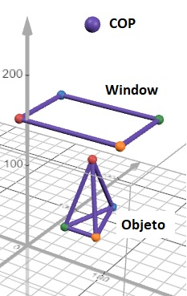

# Exercício sobre Perspectiva em papel ou em Jupyter NB com SymPy

Vencimento: terça-feira, 27 out. 2026, 09:41

---

## Exercíco unplugged ou com SymPy

Execute manualmente ou então em um Jupyter Notebook utilizando SymPy, a visualização em perspectiva para o seguinte objeto (um tetraedro irregular): Objeto: (50,100,50) (70,20,30) (30,20,30) (50,20,100); Window: (-10,150,0) (110,150,0) (110,150,80), (-10,150,80); Centro de Projeção: (50, 250, 40)

