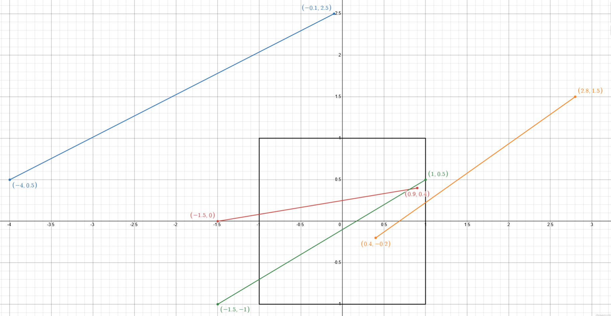

# Exercícios de Clipping feitos à mão

Vencimento: quinta-feira, 24 set. 2026, 01:05

---

## Atividade Complementar: Exercício sobre Clipping de Segmentos de Reta

## 1. Calcule a clipagem dos segmentos de reta abaixo utilizando os três algoritmos vistos em sala de aula

Considere uma window em coordenadas normalizadas [-1,1] posicionada em WC = 0,0. Tome cada um dos segmentos de reta, já representados em Coordenadas Normalizadas, dados abaixo e clipe-os contra esta window utilizando, para cada um dos segmentos, os algoritmos de C-S, L-B e N-L-N. A resolução de cada um dos problemas utilizando cada um dos algoritmos deve ser desenvolvida passo a passo, incluindo-se aí a explicitação das decisões heurísticas.

## 2. Responda à seguinte pergunta

Considere N-L-N. Qual a mais simples heurística para determinar contra quais das retas de referência que eu gerei eu comparo o coeficiente angular da reta que eu desejo clipar? Justifique.

## Requisitos

O trabalho deve ser entregue na forma de arquivo .PDF contendo as resoluções, passo a passo, organizadas por segmento de reta, mostrando, para cada segmento, o desenvolvimento para cada um dos métodos de clipagem. Você pode tanto produzir o documento de solução em um editor de texto quanto escanear a resolução em papel manual.
