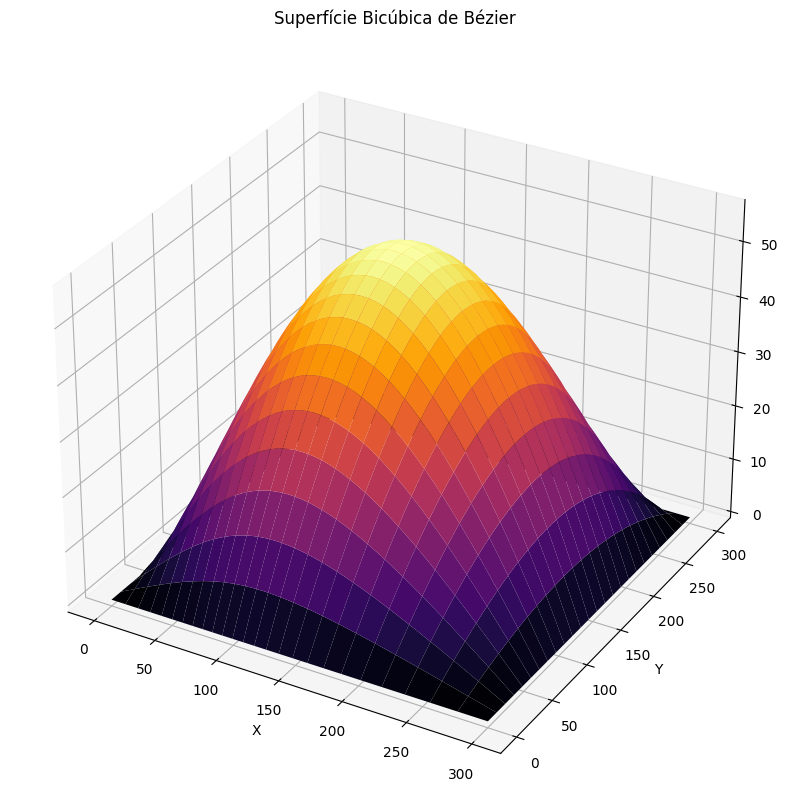

# Plotagem de Superfície Bézier Bicúbica

Vencimento: terça-feira, 3 nov. 2026, 01:05

---

## Exercício para realizar no Google Colab ou JupyterLab empregando SymPy

Inspire-se no exemplo detalhado em NumPy do Jupyter Notebook exemplificado acima.

Escolha um dos datasets adiante e plote uma superfície bicúbica de Bézier.

- Faça todos os cálculos de forma explícita, com Blending Functions
- Para tanto você pode realizar os cálculos manualmente ou então usando um Jupyter Notebook/Google Colab empregando Python (com cálculos matriciais em NumPy) ou empregando a linguagem R.
- Utilize delta = 0,2.

Dataset 1 = {{{0, 0, 0}, {0, 100, 0}, {0, 200, 0}, {0, 300, 0}},

{{100, 0, 0}, {100, 100, 100}, {100, 200, 100}, {100, 300, 0}},

{{200, 0, 0}, {200, 100, 100}, {200, 200, 100}, {200, 300, 0}},

{{300, 0, 0}, {300, 100, 0}, {300, 200, 0}, {300, 300, 0}}};

Dataset 2 = {{(0, 0, 0) (0, 0, 100) (0, 0, 200) (0, 0, 300)},

{(100, 100, 0) (100, 100, 100) (100, 100, 200) (100, 100, 300)},

{(300, 0, 0) (300, 0, 100) (300, 0, 200) (300, 0, 300)},

{(150, -100, 0) (150, -100, 100) (150, -100, 200) (150, -100, 300)}};
