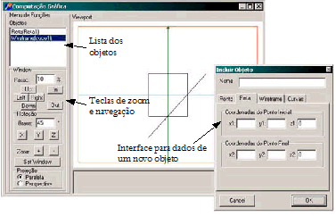
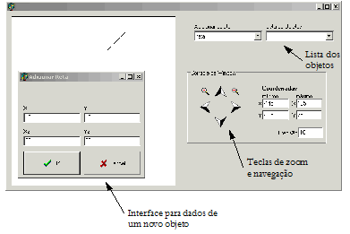

# Trabalho 1.1 - Sistema básico com Window e Viewport (versão NOVA - USE)

Vencimento: segunda-feira, 7 set. 2026, 09:42

---

O objetivo dos exercícios propostos na Parte I é a construção, passo a passo, de um Sistema Gráfico Interativo capaz de representar, em perspectiva realista, objetos em 3D como modelos de arame e também como superfícies bicúbicas renderizadas como malhas de curvas. Os exercícios são progressivos e construídos sobre os anteriores, o que significa que você necessita ter implementado o exercício anterior para pode implementar o atual, pois vai usar o código que produziu como ponto de partida para o novo exercício.

Neste seu primeiro trabalho, vamos lançar as bases do seu sistema, iniciando pela implementação de conceitos como window, viewport e display file. Para tanto, implemente o sistema básico de CG 2D contendo:

Display file para 2D capaz de representar pontos, segmentos de retas e polígonos (listas de pontos interconectados), onde: Cada objeto possui um nome, cada objeto possui um tipo e sua lista de coordenadas de tamanho variável dependendo de seu tipo. Para facilitar a sua vida mais tarde, chame o objeto polígono de wireframe;
Transformação de viewport em 2D;
Funções de Panning/navegação 2D (movimentação do window);
Funções de Zooming (modificação do tamanho do window);

## Requisitos:

Use a linguagem Python 3;
Use uma biblioteca como Tkinker ou PyQt para implementar a GUI;
Use apenas as diretivas de desenho de pontos e linhas para exibir os objetos no canvas, não use
drawPolygon
e afins;
Caso a entrada das coordenadas não seja feita com cliques do mouse no canvas, o sistema deve aceitar entradas no seguinte padrão:
(x1, y1),(x2, y2),...
Código para parsing:
pontos: List[Tuple[float]] = list(eval([input string]))
A transformada de viewport não deve distorcer os objetos. Ex.: Se um objeto for um quadrado, ele deve ser exibido como tal.

## Funções equivalentes/semelhantes no Blender (2.91):

Na visão "Top Orthographic" (NumPad 7)

Pannig: Shift + Arrastar com o botão do meio do mouse;
Zoom: Scroll do mouse;
Adicionar objetos: Shift + A.
Veja o exemplo de interface de usuário de uma realização do exercício proposto. Seu Primeiro Sistema Gráfico Interativo apresenta uma ideia de como poderá ser a interface de usuário do sistema.

## Exemplo de interface de seu primeiro Sistema Gráfico Interativo

Uma outra sugestão de interface, mais simples, pode ser vista a seguir.

Outra forma de implementar o Exercício 1.1

