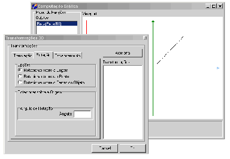

# Trabalho 1.2 - Implementação de Transformações 2D e Coordenadas Homogêneas

Vencimento: segunda-feira, 14 set. 2026, 09:42

---

Neste trabalho você vai expandir o seu SGI - Sistema Gráfico Interativo para suportar as 3 transformações básicas e a rotação arbitrária em 2D.

Para tanto você vai criar uma rotina de transformação genérica que aceita uma matriz de transformação em coordenadas homogêneas e um objeto qualquer para ser transformado e devolve este objeto após a aplicação da matriz. Esta rotina nada mais é do que uma forma extremamente simples de se implementar um engine gráfico. Para alimentar esta rotina você deve criar um conjunto de rotinas de “preparo” da matriz de transformação, que serão específicas para cada transformação.

Para poder aplicar uma transformação sobre um determinado objeto do mundo, você deve permitir ao usuário que selecione um dos objetos de seu mundo na lista de objetos, escolha a transformação que deseja aplicar e entre com os dados para esta transformação em uma interface para isso.

Alternativamente você pode implementar a interação com os objetos através do mouse: permita ao usuário usar o botão direito do mouse para abrir um menu de contexto que permite aplicar uma transformação ao objeto sob o mouse. Em 2D isso é muito fácil de se implementar. Mais tarde, quando estivermos trabalhando em 3D, você verá que necessita de um algoritmo de buffer de profundidade para saber qual é o objeto mais próximo ao mouse na tela.

Na imagem abaixo vemos a interface de um SGI mostrando a janela para entrada de dados de transformações sobre o objeto da lista que foi selecionado. Observe que a janela possui uma lista ao lado, onde são incluídas todas as transformações que se deseja realizar. A matriz de transformação resultante somente é calculada depois de o usuário entrar com todas as transformações que deseja.

## Requisitos

Incremente seu Sistema Gráfico para suportar as seguintes transformações em 2D:

Translações
Escalonamento “natural” em torno do centro do objeto
Rotações:
Em torno do centro do mundo
Em torno do centro do objeto
Em torno de um ponto qualquer (arbitrário)
Os requisitos de trabalhos anteriores continuam valendo.

Adicionalmente, o sistema deve permitir que o usuário defina uma cor de pintura para os objetos do mundo na criação deles. Esta é a cor apenas das retas (ou seja, os polígonos continuam sem preenchimento, e apenas suas bordas são pintadas).

Mais pra frente, com a inclusão de arquivos obj para salvar/carregar objetos, vai ser necessário padronizar as cores. Faremos isto com o código RGB de cada cor.

Dicas:
Na translação você simplesmente calcula a matriz no sistema de coordenadas homogêneo e aplica.

Para o escalonamento e para a rotação você vai precisar determinar o centro geométrico ou centro de massa do objeto a ser escalonado ou rotacionado. No caso da rotação nós já discutimos a razão para tanto: a rotação arbitrária que nos parece natural, é aquela onde um objeto roda em torno de seu centro. No caso do escalonamento temos a mesma situação: o escalonamento somente parece natural se o objeto parece “encolher” ou “inchar”.

## Funções equivalentes/semelhantes no Blender (2.91)

Na visão "Top Orthographic" (NumPad 7) com um objeto selecionado:
Translação: G (Grab)
Escalonamento: S (Scale)
Rotação: R (Rotate)
