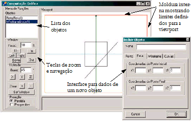

# Trabalho 1.4. Clipping: Incremente seu SGI para suportar clipping dos objetos do mundo

Vencimento: segunda-feira, 21 set. 2026, 22:08

---

Implemente as principais técnicas de clipagem para windows retangulares vistas neste capítulo, usando clipagem de pontos e clipagem por C-S, L-B ou NLN para retas, de forma a integrá-las ao seu sistema gráfico de maneira que a transformada de viewport seja aplicada apenas aos objetos resultantes do clipping.

Para ter certeza de que a clipagem está funcionando e não é o algoritmo de clipagem de pontos embutido no seu objeto de interface que está fazendo com que as linhas que você está desenhando sejam cortadas no lugar certo, faça sua viewport ser menor do que o seu objeto de desenho (canvas, subcanvas ou outra coisa que você escolheu), de maneira que a viewport inicie em coordenadas do tipo 10,10 e termine antes do fim da área de desenho, como mostra a figura abaixo, onde a viewport está limitada pela moldura imediatamente interna à área de desenho. Dessa forma, se o seu algoritmo clipar algo de forma incorreta, deixando de recortar algum elemento, você vai enxergar imediatamente pois esta será uma boa forma de debugar seu exercíco este é um subterfúgio excelente e torna desnecessário analisar os dados gerados para uma lista enorme de objetos clipados para testar o sistema.

## Requisitos

**Clipagem**:

- Clipagem de Pontos
- 2 (duas) técnicas distintas de clipagem de Segmentos de Reta, à escolha, passíveis de serem intercambiadas/selecionadas pelo usuário em um radio button.
- Clipagem de Polígonos (uma técnica à escolha).

**Representação**: Altere seu SGI para suportar clipping dos objetos do mundo:

- Faça sua Viewport ser menor do que o objeto de desenho da linguagem de programação, com uma moldura ao seu redor. Isto facilita na visualização do clipping e na detecção de erros (como visto nas transparências).
- Estenda seu SGI para suportar polígonos preenchidos, utilizando as primitivas de preenchimento da sua linguagem de programação. O usuário escolhe se o polígono é em modelo de arame ou preenchido no momento de sua criação.
